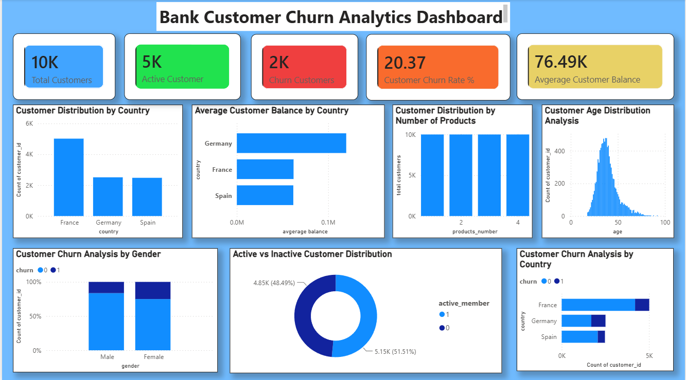

# 🏦 Bank Customer Churn Analysis | Power BI

## 📌 Project Overview

This project analyzes customer churn for a banking dataset using **Power BI and Excel**.

The objective is to identify customer segments associated with higher churn levels and understand how factors such as customer activity, geography, age, product usage, and account characteristics relate to churn.

The analysis covers **10,000 customer records** and presents the findings through an interactive Power BI dashboard.

---

## 🎯 Project Objective

The main objectives of this analysis are to:

- Analyze overall customer churn
- Identify customer segments with higher churn levels
- Compare churn across countries and customer demographics
- Analyze the relationship between customer activity and churn
- Examine product usage and account characteristics
- Present key findings through an interactive Power BI dashboard

---

## 🛠️ Tools & Technologies

- **Power BI** – Dashboard development, data visualization and analysis
- **Microsoft Excel** – Dataset management and data preparation
- **DAX** – Measures and calculated metrics

---

## 📊 Dataset

The dataset contains **10,000 customer records** and 12 attributes.

Key fields include:

- Customer ID
- Credit Score
- Country
- Gender
- Age
- Tenure
- Account Balance
- Number of Products
- Credit Card
- Active Member
- Estimated Salary
- Churn

---

## 📈 Key KPIs

| KPI | Value |
|---|---:|
| Total Customers | 10,000 |
| Churned Customers | 2,037 |
| Active Customers | 7,963 |
| Overall Churn Rate | 20.37% |

---

## 🔍 Key Insights

### 🌍 Geographic Analysis

- Germany recorded a higher churn rate compared with France and Spain.
- France and Spain showed comparatively lower churn levels.

### 👤 Customer Activity

- Customers who were not active members showed a higher churn rate than active members.
- This indicates that customer engagement is an important area to monitor.

### 📦 Product Usage

- Customers with one product showed a higher churn rate than customers with two products.
- Customers with three or four products represented smaller customer groups but showed substantially higher churn levels in this dataset.

### 👥 Customer Demographics

- Churn levels varied across customer demographic segments.
- Female customers in this dataset showed a higher churn rate than male customers.

### 💳 Credit Card Usage

- Churn rates were relatively similar between customers with and without a credit card.
- Therefore, credit card ownership alone does not show a large difference in churn within this dataset.

---

## 💡 Business Recommendations

Based on the analysis, businesses can consider:

- Developing targeted engagement strategies for inactive customers.
- Monitoring customer segments with comparatively higher churn rates.
- Investigating the reasons behind higher churn in specific geographic segments.
- Reviewing product adoption and customer experience across different product groups.
- Using customer segmentation to identify accounts that may require additional engagement.

---

## 📷 Dashboard Preview

---

## 📁 Project Files

| File | Description |
|---|---|
| [📊 Power BI Dashboard](./bank_customer_churn_dashboard.pbix) | Download and open the interactive Power BI dashboard |
| [📁 Customer Churn Dataset](./bank_customer_churn_dataset.xlsx) | Excel dataset used for the analysis |
| [🖼️ Dashboard Screenshot](./customer_churn_dashboard.png) | Dashboard preview |

---

## 📌 Business Value

This project demonstrates how customer data can be transformed into actionable business insights using **Power BI, Excel and DAX**.

The analysis can support teams in:

- Customer retention analysis
- Churn monitoring
- Customer segmentation
- Engagement strategy
- Data-driven decision making

---

## 👨‍💻 Author

**Devesh Singh**

Recent BBA Graduate | Business Analyst / Data Analyst

🔗 **Portfolio:** https://deveshwork.lovable.app/

🔗 **GitHub:** https://github.com/devesh-analytics
